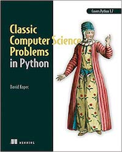

# classic-computer-science-problems-in-python
Codding parts for Classic Computer Science Problems in Python book

Code examples for the book *Classic Computer Science Problems in Python* by David Kopec



This project has a root which is a common for all chapters. For that reason, all imports start from `chapterX.file`. To run something from the console you need to set the environment variable with the root path:
```bash
export PYTHONPATH=/path-to-projects/classic-computer-science-problems-in-python
```
But I run everything including unit tests from the Intellij Idea where the project has a configured root.

# Python Tips

### Classes

Generics, static fields and methods, properties
```python
from __future__ import annotations
from typing import Generic, TypeVar, List

# TypeVar T is bound to AwesomeClassWithGenerics. This means that anything that fills in a variable that is of type T must be an instance of a AwesomeClassWithGenerics or a subclass of AwesomeClassWithGenerics
T = TypeVar('T', bound='AwesomeClassWithGenerics') # it's a string but it can be imported class name

class AwesomeClassWithGenerics(Generic[T]):
    static_field = 'ABC'
    # AwesomeClassWithGenerics.static_field and AwesomeClassWithGenerics().static_field are different
    # It's not possible to access static field via class instance variable
    
    def __init__(self, arg: T) -> None:
        self._property: T = arg 

    @staticmethod
    def some_static_method(arg: List[T]):
        ...

    @property
    def property(self) -> bool:
        return not self._property
```
Staticmethod vs classmethod
```python
class A(object):
    # Below is the usual way an object instance calls a method. The object instance, a, is implicitly passed as the first argument
    def foo(self, x):
        print(f"executing foo({self}, {x})")
    # a.foo(1)
    # executing foo(<__main__.A object at 0xb7dbef0c>, 1)

    # With classmethods, the class of the object instance is implicitly passed as the first argument instead of self
    @classmethod
    def class_foo(cls, x):
        print(f"executing class_foo({cls}, {x})")
    # a.class_foo(1)
    # executing class_foo(<class '__main__.A'>, 1)
    # or
    # A.class_foo(1)
    # executing class_foo(<class '__main__.A'>, 1)

    # With staticmethods, neither self (the object instance) nor cls (the class) is implicitly passed as the first argument. They behave like plain functions except that you can call them from an instance or the class
    @staticmethod
    def static_foo(x):
        print(f"executing static_foo({x})")
    # a.static_foo(1)
    # executing static_foo(1)
    # or
    # A.static_foo('hi')
    # executing static_foo(hi)

a = A()
```

Inheritance
```python
from abc import ABC, abstractmethod
from typing import TypeVar, Generic, List, Dict

V = TypeVar('V')
D = TypeVar('D')

class Constraint(Generic[V, D], ABC):

    def __init__(self, variables: List[V]):
        self.variables = variables

    @abstractmethod
    def satisfied(self, assignment: Dict[V, D]) -> bool:
        ...

class MapColoringConstraint(Constraint[str, str]):

    def __init__(self, place1: str, place2: str):
        # super() is sometimes used to call a method on the superclass,
        # but you can also use the name of the class itself, as in Constraint.__init__ ([place1, place2]).
        # This is especially helpful when dealing with multiple inheritance,
        # so that you know which superclass’s method you are calling.
        super().__init__([place1, place2])
        self.place1: str = place1
        self.place2: str = place2

    def satisfied(self, assignment: Dict[str, str]) -> bool:
        if self.place1 is not in assignment or self.place2 is not in assignment:
            return True
        return assignment[self.place1] != assignment[self.place2]
```
Data Class and future module
```python
from __future__ import annotations
from dataclasses import dataclass

# A class marked with the @dataclass decorator saves some tedium
# by automatically creating an __init__() method that instantiates instance 
# variables for any variables declared with type annotations in the class’s body. 
# Dataclasses can also automatically create other special methods for a class. 
# Which special methods are automatically created is configurable via the decorator. 
# See the Python documentation on dataclasses for details (https://docs.python.org/3/library/dataclasses.html).
# In short, a dataclass is a way of saving ourselves some typing.

@dataclass(eq=True, frozen=True)  # immutable, hashable
class Edge:
    u: int # the "from" vertex
    v: int # the "to" vertex

    # The method return the Edge class instance which is legal because the class 
    # is not yet defined. The __future__ import solves this problem.
    def reversed(self) -> Edge:
        return Edge(self.v, self.u)

    def __str__(self) -> str:
        return f"{self.u} -> {self.v}"
```
### Random
```python
from random import choice, choices, sample, random, randrange, shuffle
from string import ascii_uppercase

choice(ascii_uppercase) # random ascii uppercase char
choice([True, False]) # random bool value
choices([1,2,3], weights=[.2,.5,.9], k=2) # roulette-wheel selection of 2 items numbers from [1,2,3] taking items' weights into account
sample([1,2,3], k=2) # same as choices but without replacement, i.e. selected item is removed and cannot be selected again
random() # return float value from 0 to 1
randrange(100) # int from 0 to 100
shuffle([1,2,3,4])
```
### Heap or Priority Queue

I like this data structure, therefore I highlight some API for it in Python. It is min-heap.

```python
from heapq import heappush, heappop
from typing import List, TypeVar, Generic

T = TypeVar('T')

class PriorityQueue(Generic[T]):
    def __init__(self):
        self._container: List[T] = []

    @property
    def empty(self) -> bool:
        return not self._container

    def push(self, item: T) -> None:
        heappush(self._container, item)

    def pop(self) -> T:
        return heappop(self._container)
```
There are two convenient methods in heapq: nlargest/nsmallest
```python
from heapq import nlargest

nlargest(2, [1,3,2])
```