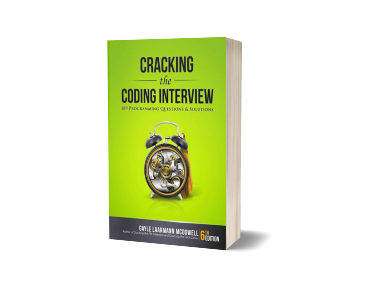

The repo contains code practices from two books and some random algorithms and design tasks

Each project has its own root which is a common for all chapters in the related book. For that reason, all imports start from `chapterX.file`. To run something from the console you need to set the environment variable with the right root path. For example:
```bash
export PYTHONPATH=/path-to-projects/algorithms-in-python/classic-computer-science-problems-in-python
```
But I run everything including unit tests from the Intellij Idea where the project has a configured root.


# Classic Computer Science Problems in Python

Codding parts for Classic Computer Science Problems in Python book

Code examples for the book *Classic Computer Science Problems in Python* by David Kopec


The link to the official code examples is [here](https://github.com/davecom/ClassicComputerScienceProblemsInPython).

# Cracking the Coding Interview



All code tasks from this book are done in Python

# Random Python Tips˚

### Classes

Equals and Hashcode
```python
class Node:
    def __init__(self, a: int, b: int):
        self.a = a
        self.b = b

    def __eq__(self, other: object) -> bool:
        if isinstance(other, 'Node'):
            self.a == other.a and self.b == other.b
        return False

    def __hash__(self) -> int:
        return hash((self.a, self.b))

```

Generics, static fields and methods, properties
```python
from __future__ import annotations
from typing import Generic, TypeVar, List

# TypeVar T is bound to AwesomeClassWithGenerics. This means that anything that fills in a variable that is of type T must be an instance of a AwesomeClassWithGenerics or a subclass of AwesomeClassWithGenerics
T = TypeVar('T', bound='AwesomeClassWithGenerics') # it's a string but it can be imported class name

class AwesomeClassWithGenerics(Generic[T]):
    static_field = 'ABC'
    # AwesomeClassWithGenerics.static_field and AwesomeClassWithGenerics().static_field are different
    # It's not possible to access static field via class instance variable
    
    def __init__(self, arg: T) -> None:
        self._property: T = arg 

    @staticmethod
    def some_static_method(arg: List[T]):
        ...

    @property
    def property(self) -> bool:
        return not self._property
```

Enums
```python
from enum import Enum

class Color(Enum):
    WHITE= 0
    GREY = 1
    BLACK = 2
```

Staticmethod vs classmethod
```python
class A(object):
    # Below is the usual way an object instance calls a method. The object instance, a, is implicitly passed as the first argument
    def foo(self, x):
        print(f"executing foo({self}, {x})")
    # a.foo(1)
    # executing foo(<__main__.A object at 0xb7dbef0c>, 1)

    # With classmethods, the class of the object instance is implicitly passed as the first argument instead of self
    @classmethod
    def class_foo(cls, x):
        print(f"executing class_foo({cls}, {x})")
    # a.class_foo(1)
    # executing class_foo(<class '__main__.A'>, 1)
    # or
    # A.class_foo(1)
    # executing class_foo(<class '__main__.A'>, 1)

    # With staticmethods, neither self (the object instance) nor cls (the class) is implicitly passed as the first argument. They behave like plain functions except that you can call them from an instance or the class
    @staticmethod
    def static_foo(x):
        print(f"executing static_foo({x})")
    # a.static_foo(1)
    # executing static_foo(1)
    # or
    # A.static_foo('hi')
    # executing static_foo(hi)

a = A()
```

Inheritance
```python
from abc import ABC, abstractmethod
from typing import TypeVar, Generic, List, Dict

V = TypeVar('V')
D = TypeVar('D')

class Constraint(Generic[V, D], ABC):

    def __init__(self, variables: List[V]):
        self.variables = variables

    @abstractmethod
    def satisfied(self, assignment: Dict[V, D]) -> bool:
        ...

class MapColoringConstraint(Constraint[str, str]):

    def __init__(self, place1: str, place2: str):
        # super() is sometimes used to call a method on the superclass,
        # but you can also use the name of the class itself, as in Constraint.__init__ ([place1, place2]).
        # This is especially helpful when dealing with multiple inheritance,
        # so that you know which superclass’s method you are calling.
        super().__init__([place1, place2])
        self.place1: str = place1
        self.place2: str = place2

    def satisfied(self, assignment: Dict[str, str]) -> bool:
        if self.place1 not in assignment or self.place2 not in assignment:
            return True
        return assignment[self.place1] != assignment[self.place2]
```
Data Class and future module
```python
from __future__ import annotations
from dataclasses import dataclass

# A class marked with the @dataclass decorator saves some tedium
# by automatically creating an __init__() method that instantiates instance 
# variables for any variables declared with type annotations in the class’s body. 
# Dataclasses can also automatically create other special methods for a class. 
# Which special methods are automatically created is configurable via the decorator. 
# See the Python documentation on dataclasses for details (https://docs.python.org/3/library/dataclasses.html).
# In short, a dataclass is a way of saving ourselves some typing.

@dataclass(eq=True, frozen=True)  # immutable, hashable
class Edge:
    u: int # the "from" vertex
    v: int # the "to" vertex

    # The method return the Edge class instance which is legal because the class 
    # is not yet defined. The __future__ import solves this problem.
    def reversed(self) -> Edge:
        return Edge(self.v, self.u)

    def __str__(self) -> str:
        return f"{self.u} -> {self.v}"
```
### Random
```python
from random import choice, choices, sample, random, randrange, shuffle, uniform
from string import ascii_uppercase

choice(ascii_uppercase) # random ascii uppercase char
choice([True, False]) # random bool value
choices([1,2,3], weights=[.2,.5,.9], k=2) # roulette-wheel selection of 2 items numbers from [1,2,3] taking items' weights into account
sample([1,2,3], k=2) # same as choices but without replacement, i.e. selected item is removed and cannot be selected again
random() # return float value from 0 to 1
randrange(100) # int from 0 to 100
shuffle([1,2,3,4])
uniform(min([1,2,3,4]), max([1,2,3,4])) # returns a random floating number between the two specified numbers (both included)
```

### Python unique syntax

Multiple for-loops can be combined in 1 line 
```python
outer = [1, 2, 3, 4]
inner = ['a', 'b', 'c']

[print(x, y) for x in outer for y in inner]
# 1 a
# 1 b
# 1 c
# 2 a
# 2 b
# 2 c
# 3 a
# 3 b
# 3 c
# 4 a
# 4 b
# 4 c

# Another way for the same output
for x in outer: [print(x, y) for y in inner]

# filter list using for loop with condition
a = [1,1,2,3]
minimum = min(a)
indices = [i for i, v in enumerate(a) if v == minimum]
```

Iterate with index
```python
# Iterate over a list with indices
for index, letter in enumerate(['A', 'B', 'C']):
    print(index, letter)
```

Swap
```python
arr = [1, 2, 3, 4]
arr[1], arr[2] = arr[2], arr[1]
```
Packing/Unpacking: * and **
```python
# Packing: We can pass any number of arguments here; "objects" is a tuples 
def tmp(*objects):
    ...
tmp(1, 'text', ["text one", "text two"], {"your", "set"}, 100, .30, {"this": "is", "your": "dict"}, ("tuple", "too"))

# Packing: We can pass any number of arguments here; "objects" is a dict 
def tmp(**objects):
    ...
tmp(name="Tony", job="Hero", quotes="I love you tons")

# Unpacking: For the variable d, we will get all remaining items thanks to the magic of unpacking
seq = ["write", "and", "work", "from", "home", "is", "awesome"]
a, b, c, *d = seq
print(d) # ['from', 'home', 'is', 'awesome']

# Unpacking: asterisk (*) before my_list will unpack/deconstruct items in my_list into separated 
# arguments passed into the print function
my_list = ["write", "from", "home"]
print(*my_list) # same as print('write', 'from', 'home')

# Unpacking: You can use double asterisk to deconstruct a dict
someweirddata = {"hello":"world"}
print({"initial data":"yati yati yata",**someweirddata})
```

### Main operations with collections

Array/List
```python
from typing import List

list: List[int] = [1,2,3] # same as list = [1,2,3]
list.append(4)
list.extend([5, 6])
list.insert(2, -1) # insert -1 at index 2 shifting elements to the right
print(list.index(-1)) # search for -1 element and return its index which is 2
list.remove(-1) # search for -1 element and removes it; throws ValueError if not present
print(list.pop(4)) # remove and returns the element at the given index
print(list.pop()) # remove and returns the last element

list.reverse() # reverse the list in place (does not return it)
list.sort() # sort the list in place (does not return it)

print(reversed(list)) # return reversed copy (does not change original)
print(sorted(list)) # return sorted copy (does not change original)

list[1,2,3,4,5]
print(list[1:-1]) # return [2,3,4]
list[0,2] = 5 # replace [2,3] with 5, i.e. change list to [5,4]

# List from range
print(list(range(5)))
```

Disctionary and Default Dictionary
```python
from collections import defaultdict

dict = {'a': 1, 'b': 2, 'c': 3}
dict2 = {tuple([1, 2]): 1} # Lists are not unhashable but Tuples are

d = defaultdict(list) # create a defaultdict with an empty list as default value
for i in range(5):
    d[i].append(i)
i = defaultdict(int) # create a defaultdict with 0 as default value
i2 = defaultdict(lambda: 1) # # create a defaultdict with 1 as default value

# Iterate through dict
for k,v in i.items():
    print(k,v)
```

Queue
```python
from collections import deque

q = deque(['a'])
q.append('b') # insert element to the right end
q.appendleft('c') # insert element at left end
print(q.pop()) # remove and returns the right-most element which 'a'
print(q.popleft()) # remove and returns the left-most element which 'c'˚
```

Set
```python
set1 = {'a', 'b', 'c'}
set2 = set() # empty set
print('a' in set1)

set1.add('d')
set1.remove('b') # throws ValueError if not present
set1.discard('b') # does not throw ValueError if not present
set1.clear()

set1.union(set2) # (set1 | set2) returns a new set with all elements from both sets
set1.intersection(set2) # (set1 & set2) returns a new set with elements common to both sets
set1.difference(set2) # (set1 - set2) returns a new set with elements in set1 but not in set2
set1.symmetric_difference(set2) # (set1 ^ set2) returns a new set with elements in either set1 or set2 but not in both
```

Heap
```python
from heapq import heapify, heappush, heappop

a = [3, 5, 1, 2, 6, 8, 7]

heapify(a) # create min heap in linear time
heappush(a, 4)
print(heappop(a)) # removed from the heap and returns 1
print(a[0]) # returns the min heap value which is 2 now
```

Priority Queue Implementation
```python
from heapq import heappush, heappop
from typing import List, TypeVar, Generic

T = TypeVar('T')

class PriorityQueue(Generic[T]):
    def __init__(self):
        self._container: List[T] = []

    @property
    def empty(self) -> bool:
        return not self._container

    def push(self, item: T) -> None:
        heappush(self._container, item)

    def pop(self) -> T:
        return heappop(self._container)
```
There are two convenient methods in heapq: nlargest/nsmallest
```python
from heapq import nlargest

nlargest(2, [1,3,2])
```

Array/List and Binary Search
```python
# bisect_left and bisect_right return the leftmost and rightmost index where the value can be inserted 
# without changing the order of elements. If the value does not exist in the list, they both return the same index. 
# The difference arises when the value exists in the list. For example, to insert 10 into the list [10,20,30] 
# without breaking the order, the leftmost index would be 0, and the rightmost index would be 1. 
# However, to insert 10.5 into the same list, both leftmost and rightmost indices would be equal to 1
from bisect import bisect_left, bisect_right

print(bisect_left([10,20,30],10)) # prints 0
print(bisect_right([10,20,30],10)) # prints 1
print(bisect_left([10,20,30],10.5)) # prints 1
print(bisect_right([10,20,30],10.5)) # prints 1
```

### Main operations with string

```python
s = 'abc'
s = s.zfill(5) # 'abc' -> '00abc'; adds zeros at the beginning of the string, until it reaches the specified length

numStr = "5"
numStr = numStr.rjust(4, '-') # '5' -> '---5'; Make string right justified of length 4 by padding 3 spaces to left
numStr = numStr.rjust(4, '-') # '5' -> '5---'; Make string left justified of length 4 by padding 3 spaces to left

print(int(numStr)) # convert string to int
print(str(5)) # convert int to string

print(''.join(['a', 'b', 'c'])) # 'a', 'b', 'c' -> 'abc'

print(s[::-1]) # reverse string
```

### Strings
```python
# Index Of
s1="banana"
print(s1.find("an"))
print(s1.find("an", 2)) # returns 3; 2 is the start parameter
print(s1.find("ba",1,5)) # return -1; 5 is the end parameter
```

### Math
```python
import math

print(math.factorial(23))
print(math.comb(7, 5)) # number of ways picking 5 unordered outcomes from 7 possibilities, without repetition, also known as combinations
```

### Bool operations
```python
import math

print(math.factorial(23))
print(math.comb(7, 5)) # number of ways picking 5 unordered outcomes from 7 possibilities, without repetition, also known as combinations
print(math.sqrt(4)) # 2
print(math.pow(2, 3)) # 8
print(math.floor(300.16)) # rounding to 300 which is int
print(math.ceil(300.16)) # rounding to 301 which is int
```
